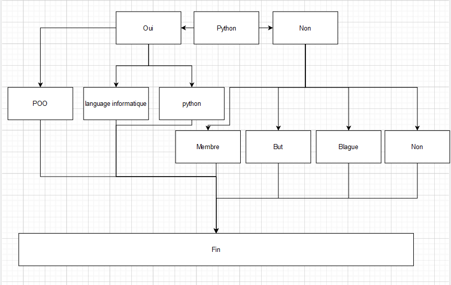

# Projet Bot Discord B2

Ce projet consiste à créer un bot Discord doté de plusieurs fonctionnalités telles qu'un historique des commandes, un système de questionnaire, une protection de l'historique, etc.

## Table des matières
- [Fonctionnalité de base](#fonctionnalité-de-base)
- [Installation](#installation)
- [Chemin de l'arbre de réponse](#chemin-de-larbre-de-réponse)
- [Fonctionnalité Bonus](#fonctionnalité-bonus)
- [Auteur](#auteur)
- [Commandes](#commandes)
- [ToDo](#todo)

## Fonctionnalité de base

- Stocker l'historique des commandes via une liste chaînée   [Working]
- Via une file, créer un systeme permettant de protéger l'intégrité de l'historique
- Via un arbre binaire , créer un système de discution  [Working]
- Via une hashtable, stocker soit l'historique
- Sauvegarde des données du bot dans un Historique [Working]

## Installation

Pour utiliser ce bot Discord, veuillez suivre les étapes suivantes :

1. Clonez le dépôt GitHub sur votre ordinateur
2. Créez un fichier `.env` à la racine du projet contenant votre token Discord
3. Dans le fichier `.env` ajouter une variable et y ajouter le token du bot
4. Lancez le script pour lancer le bot

## Chemin de l'arbre de réponse

Le bot utilise un arbre binaire pour poser une série de questions prédéfinies à l'utilisateur afin de définir son besoin. 

### Commandes le l'arbre :

- `/chatbot` : lance la conversation avec le bot
- "reset" : permet de recommencer la discussion , doit être écris quand le bot est en mode "chatbot"
- `/speakabout` : permet de savoir si un sujet est traité par le bot ou non ( le système fonctionne par mot clé )
- Sujet actuelement écris : Python , Ecla 

## Fonctionnalité Bonus

## Auteur

Ce projet a été créé par Alessandro FARAJALLAH.

## Commandes

## ToDo
- Le bot dispose également d'un système de protection de l'historique via une file. Pour éviter que plusieurs personnes travaillent sur l'historique simultanément, l'accès à l'historique est limité à une seule personne à la fois.
- Stockage des données dans une hashtable liée à l'id du compte Discord de l'utilisateur
- Mise en place d'une solution pour éviter la perte de données en cas d'arrêt du bot
- Ajout de fonctionnalités supplémentaires pour améliorer le bot Discord.

API

- Communication avec l'api
- Ajouter des mangas 
- Supprimer des mangas
